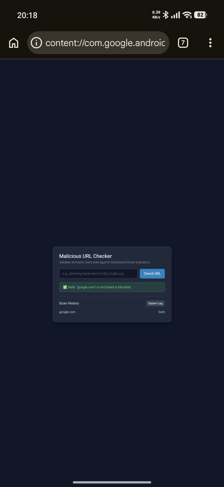
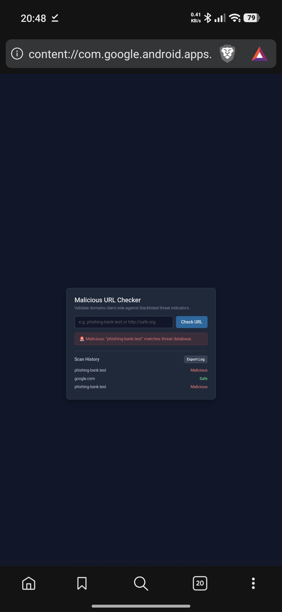

# Malicious URL Checker

A lightweight client-side tool to detect potentially malicious URLs by checking them against a threat intelligence database. Built with vanilla JavaScript for easy integration and deployment.

## Features

- 🔍 Real-time URL validation against known malicious domains
- 🌐 Client-side processing (no server required)
- 📱 Responsive design that works on all devices
- 📋 Scan history tracking with timestamps
- 📤 Export scan logs as JSON for further analysis
- ⌨️ Keyboard support (press Enter to scan)
- 🌙 Dark mode interface

## Project Description

This application allows users to quickly verify if a website is potentially malicious without sending any data to external servers. The checking happens entirely in the browser using a pre-defined list of known malicious domains. 

Key components:
- Input validation and URL parsing
- Domain matching against threat database
- Visual feedback system (color-coded results)
- Persistent scan history during session
- Export functionality for further analysis

## Setup & Installation

No installation is required! Simply download or clone this repository:

```bash
git clone https://github.com/N3RDx01/malicious-url-checker.git
cd malicious-url-checker
```

## How to Run/Use

1. Open `index.html` in any modern web browser
2. Enter a URL or domain name in the input field
3. Click the "Check URL" button or press Enter
4. View the result status (Safe/Malicious/Warning)
5. Check previous scans in the history list
6. Export all scan results using the "Export Log" button

### Usage Examples

- Valid safe URL: `https://github.com`
- Valid domain: `google.com`
- Malicious domain: `phishing-bank.test`
- Invalid input: (empty or malformed URL)

## Dependencies

None! This project uses only vanilla HTML, CSS, and JavaScript with no external libraries or frameworks.

## Code Logic Explanation

### Core Functions

1. **Domain Extraction** (`extractHostname`)
   - Takes user input and parses valid URLs
   - Handles cases with/without protocols
   - Returns normalized domain names

2. **Malicious Check** (`checkUrl`)
   - Compares extracted domains against blacklist
   - Uses efficient matching algorithm
   - Provides immediate visual feedback

3. **History Tracking** (`logResult`)
   - Stores scan results with timestamps
   - Updates UI with new entries
   - Maintains session persistence

4. **Export Functionality** (`exportLogs`)
   - Converts logs to formatted JSON
   - Triggers browser download action
   - Cleans up temporary elements

### Performance Optimizations

- Early termination in domain matching loop
- Efficient DOM updates using prepend
- Minimal memory footprint (client-side only)
- No external network requests

## Browser Support

- Chrome 60+
- Firefox 55+
- Safari 12+
- Edge 79+

## Security Notes

⚠️ This tool provides basic client-side protection only:
- Database is static unless manually updated
- No real-time threat intelligence
- Does not replace comprehensive security solutions
- Should be used as part of a layered security approach

## Customization

### Updating Threat Database

Modify the `maliciousDomains` array in the script:
```javascript
const maliciousDomains = [
  "phishing-bank.test",
  "malware-download.xyz",
  // Add more domains here
];
```

### Styling Changed

Edit CSS variables in the `<style>` section:
- Colors: Adjust hex values for themes
- Spacing: Modify padding/margin values
- Typography: Change font sizes/families

## Contributing

1. Fork the repository
2. Create a feature branch
3. Commit your changes
4. Push to the branch
5. Open a pull request

### Main Interface


